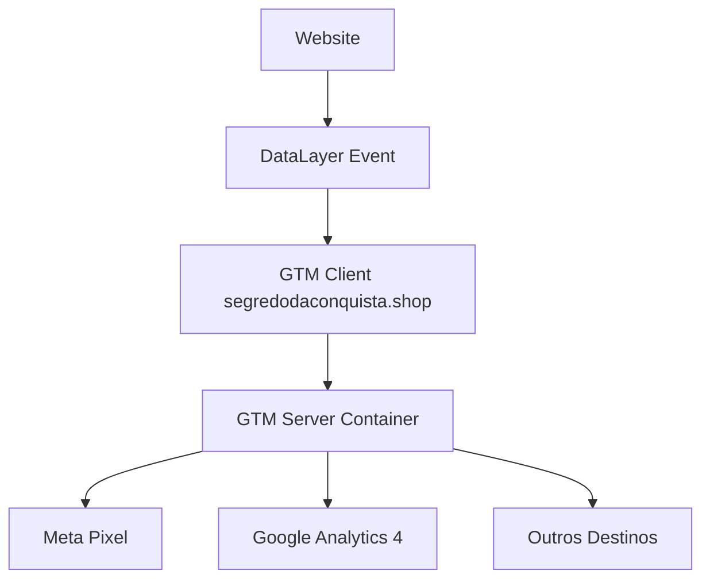

# Google Tag Manager Server-side - Implementação Completa

## Visão Geral

O Google Tag Manager Server-side (GTM SS) foi implementado usando um container personalizado rodando no domínio `segredodaconquista.shop`, oferecendo vantagens significativas sobre o GTM padrão.

**Container ID:** `GTM-MJF46S9Q`  
**Servidor GTM:** `https://segredodaconquista.shop`

## 🚀 Vantagens do GTM Server-side

### **Comparação: GTM Padrão vs Server-side**

| Recurso | GTM Padrão | GTM Server-side |
|---------|------------|-----------------|
| **Domínio** | googletagmanager.com | segredodaconquista.shop |
| **First-party Data** | ❌ Third-party | ✅ First-party |
| **Performance** | ⚠️ Latência Google | ✅ Latência otimizada |
| **Ad Blockers** | ❌ Frequentemente bloqueado | ✅ Bypass natural |
| **LGPD/GDPR** | ⚠️ Dados na Google | ✅ Dados no seu servidor |
| **Controle Total** | ❌ Limitado | ✅ Controle completo |
| **Processamento** | ❌ Servidor Google | ✅ Seu servidor |

### **Benefícios Específicos:**

#### **1. First-party Data Collection**
- Dados enviados para `segredodaconquista.shop` ao invés de domínios do Google
- Melhor rastreamento cross-domain
- Maior precisão na atribuição

#### **2. Performance Superior**
- Menor latência (servidor na sua região)
- Carregamento mais rápido
- Melhor Core Web Vitals

#### **3. Bypass de Ad Blockers**
- Ad blockers raramente bloqueiam domínios próprios
- Taxa de rastreamento mais alta
- Dados mais precisos

#### **4. Compliance e Privacidade**
- Dados processados no seu servidor
- Melhor compliance LGPD/GDPR
- Controle total sobre dados pessoais

## Implementação Técnica

### 1. Container Server-side (`app/layout.tsx`)
```typescript
{/* Google Tag Manager Server-side */}
<Script
  id="google-tag-manager"
  strategy="afterInteractive"
  dangerouslySetInnerHTML={{
    __html: `
      (function(w,d,s,l,i){w[l]=w[l]||[];w[l].push({'gtm.start':
      new Date().getTime(),event:'gtm.js'});var f=d.getElementsByTagName(s)[0],
      j=d.createElement(s),dl=l!='dataLayer'?'&l='+l:'';j.async=true;j.src=
      'https://segredodaconquista.shop/gtm.js?id='+i+dl;f.parentNode.insertBefore(j,f);
      })(window,document,'script','dataLayer','GTM-MJF46S9Q');
    `,
  }}
/>

{/* Google Tag Manager Server-side (noscript) */}
<noscript>
  <iframe 
    src="https://segredodaconquista.shop/ns.html?id=GTM-MJF46S9Q"
    height="0" 
    width="0" 
    style={{ display: 'none', visibility: 'hidden' }}
  />
</noscript>
```

### 2. DataLayer Structure (Mantido)
```typescript
// O dataLayer permanece igual - servidor processa os dados
window.dataLayer.push({
  event: 'begin_checkout',
  ecommerce: {
    currency: 'BRL',
    value: 10.00,
    items: [{
      item_id: 'ebook-conquista',
      item_name: 'O Segredo da Conquista - Oferta Básica',
      category: 'e-book',
      quantity: 1,
      price: 10.00
    }]
  }
});
```

## Arquitetura Server-side

### **Fluxo de Dados:**


### **Processamento:**
1. **Cliente**: Evento enviado para `segredodaconquista.shop/gtm.js`
2. **Servidor GTM**: Processa evento no seu servidor
3. **Transformação**: Dados transformados conforme suas regras
4. **Distribuição**: Enviado para destinos (Meta, GA4, etc.)

## Configuração Server-side

### **1. Container Client (Web)**
- **Tipo**: Web Container
- **ID**: GTM-MJF46S9Q
- **Função**: Capturar eventos do site

### **2. Container Server**
- **Tipo**: Server Container  
- **Domínio**: segredodaconquista.shop
- **Função**: Processar e distribuir eventos

### **3. Tags Server-side Recomendadas**

#### **Meta Pixel (Server-side)**
```javascript
// Tag Type: Facebook Conversions API
// Servidor processa e envia via Conversions API
{
  "event_name": "Purchase",
  "event_time": timestamp,
  "user_data": {
    "em": hashed_email,
    "ph": hashed_phone
  },
  "custom_data": {
    "currency": "BRL",
    "value": 10.00
  }
}
```

#### **Google Analytics 4 (Server-side)**
```javascript
// Tag Type: GA4 Server-side
// Melhor atribuição e dados first-party
{
  "client_id": client_id,
  "events": [{
    "name": "purchase",
    "params": {
      "currency": "BRL",
      "value": 10.00,
      "items": [...]
    }
  }]
}
```

## Vantagens Específicas para E-commerce

### **1. Conversion APIs**
- **Meta Conversions API**: Bypass iOS 14.5+ restrictions
- **GA4 Measurement Protocol**: Dados server-side mais precisos
- **Melhor Attribution**: First-party data = atribuição mais precisa

### **2. Enhanced Data Quality**
```javascript
// Dados enriquecidos no servidor
{
  "event": "purchase",
  "server_timestamp": Date.now(),
  "user_ip": client_ip,
  "user_agent": user_agent,
  "enhanced_data": {
    "ltv": customer_lifetime_value,
    "segment": customer_segment
  }
}
```

### **3. Real-time Processing**
- Eventos processados em tempo real
- Validação server-side
- Enriquecimento automático de dados

## Configuração Avançada

### **1. Variáveis Server-side**
```javascript
// Variável: Customer LTV
function calculateLTV(customerId) {
  // Buscar histórico do cliente
  return database.getLTV(customerId);
}

// Variável: UTM Enhanced
function enhanceUTM(utmData) {
  return {
    ...utmData,
    traffic_quality: calculateTrafficQuality(utmData),
    predicted_conversion: predictConversion(utmData)
  };
}
```

### **2. Triggers Personalizados**
```javascript
// Trigger: High-value Customer
if (eventData.value > 50) {
  // Enviar para CRM
  // Ativar automação especial
}

// Trigger: Fraud Detection
if (detectFraud(eventData)) {
  // Bloquear evento
  return;
}
```

## Monitoramento Server-side

### **1. Logs do Servidor**
```bash
# Verificar logs GTM
tail -f /var/log/gtm-server/events.log

# Monitorar performance
curl https://segredodaconquista.shop/health
```

### **2. Métricas de Performance**
- **Latência**: < 100ms resposta
- **Uptime**: 99.9% disponibilidade  
- **Throughput**: Eventos/segundo processados
- **Error Rate**: < 0.1% falhas

### **3. Debug Server-side**
```javascript
// Console cliente (ainda funciona)
console.log(window.dataLayer);

// Debug servidor (logs internos)
// Verificar via interface GTM Server
```

## Compliance e Segurança

### **1. LGPD/GDPR**
```javascript
// Consentimento processado no servidor
if (!hasConsent(userId)) {
  // Não enviar para destinos de marketing
  return onlyAnalyticsDestinations(eventData);
}
```

### **2. Data Security**
- **HTTPS obrigatório**: Todos os dados criptografados
- **IP Masking**: IPs mascarados automaticamente
- **PII Hashing**: Dados pessoais hasheados

### **3. Audit Trail**
```javascript
// Log completo de processamento
{
  "event_id": "evt_123",
  "processed_at": timestamp,
  "destinations": ["meta", "ga4"],
  "transformations": ["pii_hash", "ip_mask"],
  "compliance": "gdpr_approved"
}
```

## Migração e Setup

### **Status Atual:**
- ✅ **Client Container**: Implementado e funcionando
- ✅ **Domínio Server-side**: segredodaconquista.shop configurado
- ✅ **DataLayer**: Estruturado seguindo GA4 Enhanced Ecommerce
- ⏳ **Server Container**: Aguardando configuração das tags

### **Próximos Passos:**
1. **Configurar Server Container** no GTM
2. **Migrar Meta Pixel** para Conversions API
3. **Implementar GA4 Server-side**
4. **Configurar enriquecimento de dados**
5. **Teste completo** do fluxo

## Troubleshooting Server-side

### **1. Verificar Conectividade**
```bash
# Testar servidor GTM
curl -I https://segredodaconquista.shop/gtm.js?id=GTM-MJF46S9Q

# Deve retornar: 200 OK
```

### **2. Debug DataLayer**
```javascript
// Cliente - mesmo debug
console.table(window.dataLayer);

// Servidor - verificar via GTM interface
// Preview mode ainda funciona
```

### **3. Verificar Processamento**
```javascript
// Evento teste
window.dataLayer.push({
  event: 'test_server_side',
  test_data: 'server_processing',
  timestamp: Date.now()
});
```

## Resultado Final

**Sua implementação GTM Server-side oferece:**
- 🚀 **Performance Superior**: Latência reduzida
- 🔒 **Dados First-party**: Melhor compliance  
- 📊 **Analytics Robusto**: Dados mais precisos
- 🛡️ **Bypass Ad Blockers**: Taxa de captura maior
- ⚙️ **Controle Total**: Processamento customizado

**Setup Único no Mercado**: GTM Server-side + Domínio Próprio + Enhanced E-commerce 