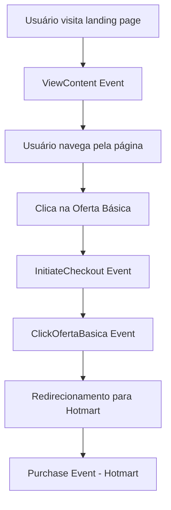

# Integração Hotmart - Checkout

## Visão Geral

A página de vendas "O Segredo da Conquista" está integrada com o Hotmart para processamento de pagamentos. O sistema de rastreamento Meta Pixel + UTMify captura toda a jornada do usuário até o momento do checkout.

## Links de Checkout

### Oferta Básica (R$ 10,00)
- **Link**: [https://pay.hotmart.com/B99891758K?checkoutMode=10](https://pay.hotmart.com/B99891758K?checkoutMode=10)
- **Preço no Hotmart**: $2.00 USD (equivalente a ~R$ 10,00)
- **Produto**: "O Segredo para Conquistar a mulher dos seus sonhos"
- **Autor**: JPMarketing
- **Status**: ✅ **Implementado**

### Oferta Premium (R$ 27,90)
- **Link**: [https://pay.hotmart.com/D100199039R?checkoutMode=10](https://pay.hotmart.com/D100199039R?checkoutMode=10)
- **Preço**: R$ 27,90
- **Produto**: Pacote completo com 5 e-books
- **Status**: ✅ **Implementado**

## Implementação Técnica

### Rastreamento de Eventos

#### 1. Antes do Checkout (InitiateCheckout)
```javascript
// Evento disparado quando usuário clica no botão
trackInitiateCheckout(10, "BRL", "O Segredo da Conquista - Oferta Básica")

// Evento personalizado com dados UTM
trackCustomEvent("ClickOfertaBasica", {
  content_name: "O Segredo da Conquista - Oferta Básica",
  value: 10,
  currency: "BRL",
  // Dados UTM adicionados automaticamente:
  utm_source: "facebook",
  utm_medium: "cpc", 
  utm_campaign: "conquista_2024",
  traffic_source: "facebook"
})
```

#### 2. Redirecionamento para Checkout
```javascript
// Redirecionamento com delay para garantir envio dos eventos
setTimeout(() => {
  window.open("https://pay.hotmart.com/B99891758K?checkoutMode=10", "_blank")
}, 100)
```

### Fluxo de Conversão



## Configuração do Meta Pixel

### Eventos Automáticos
- ✅ **PageView**: Carregamento da página
- ✅ **ViewContent**: Visualização do produto (R$ 10,00)
- ✅ **InitiateCheckout**: Clique no botão de compra
- ✅ **Lead**: Demonstração de interesse

### Eventos Personalizados
- ✅ **LandingPageView**: Carregamento específico da landing
- ✅ **ClickOfertaBasica**: Clique na oferta de R$ 10,00
- ✅ **ClickOfertaCompleta**: Clique na oferta de R$ 27,90
- ✅ **InteresseNoProduto**: Scroll para CTA
- ✅ **ViewProblemSection**: Visualização dos problemas
- ✅ **ViewTestimonials**: Visualização dos depoimentos

## Dados Enviados para o Facebook

### Estrutura Completa dos Eventos
```javascript
{
  // Dados do evento
  event_name: "InitiateCheckout",
  content_name: "O Segredo da Conquista - Oferta Básica",
  content_type: "product",
  content_category: "e-book",
  value: 10.00,
  currency: "BRL",
  
  // Dados UTM (adicionados automaticamente)
  utm_source: "facebook",
  utm_medium: "cpc",
  utm_campaign: "conquista_2024",
  utm_content: "video_1",
  utm_term: "como_conquistar",
  fbclid: "IwAR1...",
  gclid: "not_set",
  traffic_source: "facebook"
}
```

## Hotmart - Informações do Produto

### Dados do Checkout (Oferta Básica)
- **URL**: https://pay.hotmart.com/B99891758K?checkoutMode=10
- **Preço**: $2.00 USD
- **Moeda**: USD (dólares americanos)
- **Produto**: "O Segredo para Conquistar a mulher dos seus sonhos"
- **Autor**: JPMarketing
- **ID do Produto**: B99891758K
- **Código de Rastreamento**: CKTID-B99891758K1-1749474133240-5069

### Campos do Formulário Hotmart
- E-mail do comprador
- Confirmação de e-mail
- Nome completo
- Telefone
- Endereço completo
- Método de pagamento (Cartão, Conta Hotmart)

## Configuração de Campanhas

### URLs Recomendadas

#### Facebook Ads
```
https://seusite.com/?utm_source=facebook&utm_medium=cpc&utm_campaign=conquista_hotmart&utm_content=oferta_10&fbclid={fbclid}
```

#### Google Ads
```
https://seusite.com/?utm_source=google&utm_medium=cpc&utm_campaign=conquista_hotmart&utm_content=oferta_10&gclid={gclid}
```

#### Instagram
```
https://seusite.com/?utm_source=instagram&utm_medium=social&utm_campaign=conquista_hotmart&utm_content=stories
```

### Audiências para Retargeting

#### 1. Visitantes da Landing Page
```javascript
// Pessoas que visualizaram o produto
event = "ViewContent"
content_name = "O Segredo da Conquista - E-book"
```

#### 2. Pessoas que Iniciaram Checkout
```javascript
// Pessoas que clicaram para comprar mas não finalizaram
event = "InitiateCheckout"
value >= 10
```

#### 3. Por Fonte de Tráfego
```javascript
// Segmentar por canal
utm_source = "facebook"    // Visitantes do Facebook
utm_source = "google"      // Visitantes do Google
utm_source = "instagram"   // Visitantes do Instagram
```

## Métricas de Performance

### KPIs Principais
- **Taxa de Clique para Checkout**: ViewContent → InitiateCheckout
- **Taxa de Conversão**: InitiateCheckout → Purchase (no Hotmart)
- **Custo por Checkout Iniciado (CIC)**
- **Retorno sobre Investimento Publicitário (ROAS)**

### Fórmulas
```
Taxa de Clique para Checkout = (InitiateCheckout / ViewContent) × 100
Custo por Checkout = Gasto Total / Total de InitiateCheckout
ROAS = (Receita de Vendas / Gasto Publicitário) × 100
```

## Próximos Passos

### 1. Evento Purchase (Prioridade Alta)
- Implementar webhook do Hotmart para capturar compras finalizadas
- Enviar evento Purchase para o Meta Pixel com valor exato
- Incluir dados UTM na compra para atribuição correta

### 2. Oferta Premium (Prioridade Média)
- Criar checkout separado no Hotmart para oferta de R$ 27,90
- Implementar rastreamento específico para oferta premium
- Configurar eventos de upsell/cross-sell

### 3. Otimizações (Prioridade Baixa)
- A/B testing de preços (R$ 10,00 vs outros valores)
- Testes de copy nos botões de CTA
- Análise de abandono de carrinho

## Webhook Hotmart (Implementação Futura)

### Estrutura para Receber Purchase Events
```javascript
// Endpoint para webhook do Hotmart
POST /api/hotmart-webhook

// Payload esperado
{
  "event": "PURCHASE_COMPLETE",
  "data": {
    "product": {
      "id": "B99891758K",
      "name": "O Segredo para Conquistar a mulher dos seus sonhos"
    },
    "purchase": {
      "price": 2.00,
      "currency": "USD",
      "buyer_email": "usuario@email.com"
    }
  }
}
```

### Envio para Meta Pixel
```javascript
// Quando receber webhook, enviar Purchase event
fbq('track', 'Purchase', {
  value: 10.00,
  currency: 'BRL',
  content_name: 'O Segredo da Conquista - Oferta Básica',
  content_type: 'product',
  // Recuperar dados UTM do localStorage ou database
  utm_source: utmData.utm_source,
  utm_campaign: utmData.utm_campaign,
  traffic_source: utmData.traffic_source
});
```

## Troubleshooting

### Problemas Comuns

#### 1. Checkout não abre
- Verificar se o link está correto
- Verificar bloqueadores de popup
- Testar em modo incógnito

#### 2. Eventos não disparam
- Verificar console do navegador
- Confirmar carregamento do Meta Pixel
- Validar dados UTM

#### 3. Dados UTM perdidos
- Verificar persistência no localStorage
- Confirmar captura inicial do UTMify
- Validar mapeamento de fontes de tráfego

### Debug
```javascript
// Verificar eventos no console
console.log('Meta Pixel carregado:', window.fbq);
console.log('UTMify carregado:', window.utmify);
console.log('Dados UTM:', localStorage.getItem('utmify_data'));
``` 